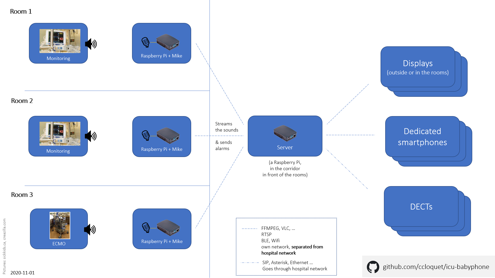

# ICU babyphone network

_**Decrease the burden on nursing staff** through a modern babyphone solution that transmits **identifiable** ICU monitoring alarms to **multiple** displays, dedicated smartphones, DECTs, or any other computer._

**Motivation**: during the Covid-19 crisis, temporary intensive care units (ICU) with isolated rooms have been created and equipped with biomedical equipment (monitoring, ECMOs, ...). These devices fire alarms, but often the sound cannot be heard outside the room. Because of the temporary nature of the rooms, the devices are not linked to a central desk like in established ICU. When there is a central desk, no nurse is available to check it. 

Sometimes, babyphones are used to transmit the alarms from the room, but they cannot be carried by several people at a time, they are too far to be heard and their alarms are not specific: it is often difficult to distinguish which device is ringing, and that causes either losses of time and energy for the staff (false positives), or degraded care to the patients (false negatives).

There is therefore a need for a versatile and robust solution that can relay the alarms of any biomedical device and specify which device is ringing. The following solution is based on a set of Raspberry Pi devices.


**Proposed solution** (work in progress)





## Table of contents
0. [Features](#features)
1. [Material](#material)
2. [Basic install](#basicinstall)
3. [Establish a WiFi network between the Pi's](#wifi)
4. [Audio streaming](#audiostreaming)
5. [Detect when the when the sound meets some criteria (volume, frequency)](#detect)
6. [Transmission of alarms uthrough a digital channel](#digitalalarms)
7. [Relay the sounds/alarms to a DECT](#dect)
8. [Finalisation](#final)
9. [Other references](#refs)

## 0. Features <a name="features"></a>

 1. **broadcasts the sounds** of the alarms inside an ICU room to any device outside (eg: a smartphone, a computer, ...)
    - this uses 3 Raspberry Pi (1 as a mike in the room (for more specificity, you can have one mike per device), 1 as a server outside the room and 1 as a receiver). Other devices like, eg, dedicated smartphones can be used. In small setups, the server and the receiver may be the same device.
    - technology: RTSP
    - software: FFMPEG, VLC, RTSP-SERVER
 
 2. **notifies the user** that an device is ringing from inside the room
    - using the same Raspberry Pis or not (mike-server-receiver)
    - technology: Bluetooth Low Energy beacon frames
   
 The combination of 1 & 2 is designed for the reliability (should one fail, the other is expected to work). See the discussion about reliability in the issues.
 
 Note: in this tutorial, a network is created between the Pi's. It can be completely distinct of the network of the hospital, though it may be linked to it. Any sufficiently robust/secured network could be used.

## 1. Material <a name="material"></a>
  - let n<sub>m</sub> be the number of microphones (_babymikeXXX_), n<sub>s</sub> be the number of servers (_babyserverXXX_), n<sub>r</sub> the number of receivers (_babyreceiverXXX_), and n<sub>tot</sub> = n<sub>m</sub> + n<sub>s</sub> + n<sub>a</sub>.
  - then you need:
    - n<sub>tot</sub> Raspberry Pi 4
    - n<sub>tot</sub> official Raspberry Pi alim (3A)
    - n<sub>tot</sub> Kingston 32 Gb class-10 micro SD card
    - n<sub>tot</sub> Raspberry Pi case
  - you also need:
    - n<sub>m</sub> USB microphone (this [one](https://www.amazon.fr/gp/product/B086PH9ZZX) works but is of low quality:  -- try to buy from your local shop)
  - and finally
    - 1 computer with Ethernet port
    - 1 Ethernet cable (crossover or not)
    - optionally 1 dedicated smartphone per person that should receive the alarms
    - may be useful:
      - USB cables for the microphones 
      - a keyboard
      - a mini-HDMI to HDMI converter or cable
    
## 2. Basic install <a name="basicinstall"></a>
  - install [Raspberry Pi Imager](https://www.raspberrypi.org/blog/raspberry-pi-imager-imaging-utility/) on your computer
  - share the internet connection of your computer with its Ethernet port (Windows: in network configuration > properties of the wifi > sharing > over Ethernet)
  - on each micro-SD card
    - install the Raspbian lite distro (~400 Mb) 
    - create a folder named "ssh" (without quotes) at the root
  - on each _babymike_
      - connect a USB-microphone
  - on each Pi
    - connect the Ethernet cable
    - using you preferred SSH client (eg: Putty), connect to raspberrypi.local (login: pi, password:raspberry)
    - change the default SSH password using the ```passwd``` command
    - ```sudo raspi-config```
      - enter hostname:
        - for the servers, eg, babyserver000 
        - for the microphones, eg, babymike000, babymike001, ... 
        - for the receivers, eg, babyreceiver000, babyreceiver001, ... 
      - optional: wireless lan (not needed if your computer shares its internet connection through the ethernet cable)
        - the local wifi router should be in 2.4 Ghz
        - enter the SSID & password of your local wifi router
      - reboot
    - connect again to the Pi through the Ethernet cable
      - from now on, the Pi can be accessed through the Ethernet cable using {hostname}.local instead of raspberrypi.local
      - ```
        sudo apt-get update
        sudo apt-get upgrade
        sudo apt-get install git vim vlc ffmpeg
        ```
        
## 3. Establish a WiFi network between the Pi's <a name="wifi"></a>

### 3.1 Configure the _babyserverXXX_ as an access point 
  - follow: https://www.raspberrypi.org/documentation/configuration/wireless/access-point-routed.md
  - skip the routing section if you do not want to route to the internet through the ethernet connection
  - the above tutorial proposes
    - the 192.168.4.* range (adjust to avoid conflicts with your other networks)
    - DHCP adresses attribution between 192.168.4.2 and 192.168.4.20 (adjust in function of the number of devices in your network)
      - note: can accept fixed ips outside this range
  - use, eg, ```ssid=babynet000``` as SSID

### 3.2 Configure the _babymikeXXX_ & _babyalarmXXX_ to connect to the access point
  - follow: https://raspberrypihq.com/how-to-connect-your-raspberry-pi-to-wifi/
  - note: any Pi of the network can be accessed from the connection to any other Pi (eg: ssh to _babyserver000_, then from there, ssh to _babymike001_)
  
## 4. Audio streaming <a name="audiostreaming"></a>

### 4.1 Tests on the _babymikeXXX_ (won't be used in prod)
  - test the mike: ```sudo arecord --device=hw:1,0 --format S16_LE --rate 44100 -V mono -c1 voice.wav```
  - troubleshooting: https://github.com/synesthesiam/voice2json/issues/28
  - basic streaming from _babymikeXXX_ to _babyserverXXX_ 
    - source : https://blog.mutsuda.com/raspberry-pi-into-an-audio-spying-device-7a56e7a9090e#.fr4l82xek
    - ```arecord -D plughw:1,0 -f dat | ssh -C pi@192.168.4.1 aplay -f dat```
    - enter the password of the _babyserverXXX_
    - listen on the _babyserverXXX_ (through HDMI or headphones)
        - listening to the radio (works also in VLC)
      ```cvlc -A alsa,none --alsa-audio-device default http://icecast.omroep.nl/radio2-bb-mp3.m3u```
  - advanced streaming    
    - streaming on the babymike itself
       ```
       ffmpeg -re -f alsa -i plughw:1,0 -acodec mp3 -ab 128k -ac 2 -f rtp rtp://localhost:1234
       cvlc -A alsa,none --alsa-audio-device default rtp://localhost:1234
       ```
    - does this work?
       on the mike: ```ffmpeg -re -f alsa -i plughw:1,0 -acodec mp3 -ab 128k -ac 2 -f rtp rtp://192.168.4.1:1234```
       on the server: ```cvlc -A alsa,none --alsa-audio-device default rtp://192.168.4.1:1234```
   
### 4.2 Advanced streaming (with compression & server -- for production)
  
  - **to install a streaming server on the _babyserver_:**
    ```
    sudo apt-get install libmoose-perl liburi-perl libmoosex-getopt-perl libsocket6-perl libanyevent-perl
    sudo cpan AnyEvent::MPRPC::Client
    cd
    git clone https://github.com/revmischa/rtsp-server
    cd rtsp-server
    perl Makefile.PL
    sudo make
    sudo make test
    sudo make install
    ```  
     
  - **to run, on the _babyserver_:**
    ```  
    sudo -b /home/pi/rtsp-server/rtsp-server.pl
    ```   
  
  - **to run, on the _babymike_:**
    ```
    sudo -b ffmpeg -re -f alsa -i plughw:1,0 -acodec mp3 -ab 128k -ac 2 -f rtsp rtsp://192.168.4.1:5545/babymike000
    ```

  - **from now on, you can listen on any device of the network (Pi, smartphone, ...) the sounds heard by the babymikes**, eg:
    - on a smartphone, using VLC/VLC for Android/... 
    - on a Pi (eg: _babyreceiver_), using the command: ```cvlc -A alsa,none --alsa-audio-device default rtsp://192.168.4.1/babymike000```
      
  - question/issue: max duration? https://www.raspberrypi.org/forums/viewtopic.php?t=149457
  - source:  https://github.com/revmischa/rtsp-server
  
### 4.3. **On the _babyalarm_, play the audio**
  - _babyalarm_ is a Raspberry Pi client of the _babyserver_
  - it also receives the BLE frames

   - on _babyalarm_ itself
     - may be connected on an HDMI display
     - VLC could display a visualization
     - there should be one player per Pi
  
  - on a smartphone
    - audio: VLC for Android

## 5. **On the _babymike_, detect when the when the sound meets some criteria (volume, frequency)**  <a name="detect"></a>
  - install
    ```
     sudo apt-get install libasound-dev libatlas-base-dev
     cd
     wget http://www.portaudio.com/archives/pa_stable_v190600_20161030.tgz
     tar -xvf pa_stable_v190600_20161030.tgz
     rm pa_stable_v190600_20161030.tgz
     cd portaudio
     ./configure && make
     sudo make install
     cd
     sudo ldconfig
     sudo pip3 install numpy
     sudo pip3 install sounddevice
     ```
   
   - spectrogram.py (in this repo) displays a real time spectrogram: 
     ```cd
     wget https://raw.githubusercontent.com/ccloquet/ICU-babyphone/main/spectrogram.py?token=ABOSWY6MT3VZS3DM4226GN27VA5TE
     ```
     - eg: ```sudo python3 spectrogram.py -c 16 -r 16 5000 -g 100``` 
   - these data can be used to extract signatures of the alarms
   - TODO: manually build a database (frequencies, volumes -- taking account noise & potential other alarms) 
   - need to modify the integration time ?
   - it seems that the microphone should be very close to the monitoring -> have a USB cable
   - there should be some minimal calibration made on-site (essentially the gain, but maybe also the signature)
     - as the access to the room may be difficult, the calibration should be done from outside
     - => access to the pi trough SSH from the outside
   - sources: https://moduliertersingvogel.de/2018/11/07/measure-loudness-with-a-usb-micro-on-a-raspberry-pi, https://python-sounddevice.readthedocs.io/en/0.4.1/examples.html#real-time-text-mode-spectrogram
   
## 6. Transmission of digital alarms using a digital channel <a name="digitalalarms"></a>
  - **goal**
    - to send more specific information (=which device precisely is ringing)
    - to have a backup link if the ffmpeg stream/Wifi does not work
   
### 6.1. More reliable, using Tasker + bidoismorgan.httpevent app
  
  - the _babymike_ tiggers a small web server on _babyserver_
  - on receiving the trigger, the webserver send a POST to the smartphones as below. It updates its state so that it can be polled by the _babyreceiver_
  - the notification from the _babyserver_ to the smartphone uses Tasker+this plugin: https://play.google.com/store/apps/details?id=bidoismorgan.httpevent
    - on the server: curl -d "param1=value1&param2=value2" -X POST 192.168.4.17:8765, where the IP adress is the IP **of the phone**
    - it requires a fixed IP adress (or some mechanism to let the server know the adress)
    - the server could also broadcast the POST to all the devices connected to it

### 6.2 **Using Bluetooth Low Energy beacons**    
  - the BLE path as a backup solution only
  - not really reliable (see 6.2.5 below)
  
#### 6.2.1. **From the babymike: send BLE frames**
  - to start:
    ```
    sudo hciconfig hci0 up
    sudo hciconfig hci0 leadv 3
    sudo hcitool -i hci0 cmd 0x08 0x0008 1c 02 01 06 03 03 aa fe 14 16 aa fe 10 00 02 63 69 72 63 75 69 74 64 69 67 65 73 74 07 00 00 00
    ```
    
  - to stop: 
    ```sudo hciconfig hci0 down```

  - source: https://medium.com/@bhargavshah2011/converting-raspberry-pi-3-into-beacon-f01b3169e12f (explains with Eddystone), https://pimylifeup.com/raspberry-pi-ibeacon/ (explains with BLE + how to generate uuid)
  - increase BLE advertising intrval: https://stackoverflow.com/questions/21124993/is-there-a-way-to-increase-ble-advertisement-frequency-in-bluez/21126744

#### 6.2.2. **On the _babyserver_: receive BLE frames**
  - **goal: on receiving a particular UUID, fire an alarm (may be a gentle music)/show something on the screen**
      
  - install:
    ```
    sudo apt-get install python3-pip python3-dev ipython3 bluetooth libbluetooth-dev
    sudo pip3 install pybluez
    cd
    git clone https://github.com/ccloquet/BLE-Beacon-Scanner.git
    ```
  
  - basic usage, on the _babyserver_
  ```sudo python3 /home/pi/BLE-Beacon-Scanner/BeaconScanner.py```

  - TODO: adapt the code (eg: remove all the unneeded parts, sound an alarm on frame detection, etc)
  
  - source: https://github.com/singaCapital/BLE-Beacon-Scanner   

#### 6.2.3. **_On the babymike_: send the BLE frames when the sound meets these criteria**, and stop them when they stop meeting these criteria, for, eg, 10 seconds in  row
  - in spectrogram.py:
    - one UUID per signature per device
    - => major = device ID
    - => minor = signature ID

#### 6.2.4. **On the _babyserver_, rebroadcast the Bluetooth frames**

#### 6.2.5. **On the _babyreceiver_ play/display the alarms on BLE detection**
 - on the _babyreceiver_ itself, show the status as large color blocks
    - python
    - use BLE-Beacon-Scanner.py
    - play a gentle sound:
   https://raspberrypi.stackexchange.com/questions/94098/reliable-way-to-play-sound-ogg-mp3-in-python-on-pi-zero-w, https://raspberrypi.stackexchange.com/questions/7088/playing-audio-files-with-python
 - on a smartphone
    - Tasker for the BLE frames: https://forum.frandroid.com/topic/69334-tasker-aideinfoscreation-de-profils/page/9/ (not working for ibeacons ?)
    - **Beacon Locator**: https://play.google.com/store/apps/details?id=com.samebits.beacon.locator&hl=en
      - https://www.reddit.com/r/tasker/comments/6k8g2k/ibeacon_radbeacon_a_simple_way_to_use_beacons/
      - no need for tasker
      - just use the notification feature of Beacon Locator
      - how long does it need after the beacon transmission has been initiated?
        - background scan every 60 seconds => 30 seconds on average, 60 sec max. Add to that smth like 10-20 seconds to detect the alarm and broadcast the first BLE frame + this first frame might be missed => too long
        - => need to develop a dedicated app?
      - is it working on the long run?
      - is the app not killed by the battery optimizer?
      - reliable?

### 6.3. Other notification possibilities
  - through SIP (see below)
  - through the sending of an email (works with local server)
  - through XMPP
  - a dedicated app that polls the _babyserver_
  
## 7 Relay the sounds/alarms to a DECT <a name="dect"></a>
  - would involve a SIP connection to the phone network of the hospital
  - use ASTERISK?
  - may play a sound describing the alarm

## 8. Finalisation <a name="final"></a>

### 8.1. Keepalive
  - send a BLE frame every 10 seconds
  - if two in a row are missing => sound an alarm

### 8.2. Autoload on boot

## Other references <a name="refs"></a>

  - FFMPEG streaming: https://trac.ffmpeg.org/wiki/StreamingGuide, https://www.raspberrypi.org/forums/viewtopic.php?t=226843, http://sharonleal.me/, http://iltabiai.github.io/2018/03/17/rpi-stream.html, https://blog.tremplin.ens-lyon.fr/GerardVidal/faire-du-streaming-live-avec-une-raspberry-pi-et-les-ressources-de-lens-ife.html, https://raspberrypi.stackexchange.com/questions/32677/setup-microphone-stream-and-turn-your-raspberry-pi-into-a-baby-phone
  - VLC: https://www.videolan.org/streaming-features.html
  - BLE: https://www.argenox.com/library/bluetooth-low-energy/using-raspberry-pi-ble/
  - WebRTC Streaming: https://github.com/kclyu/rpi-webrtc-streamer
  - usb audio: https://www.seeedstudio.com/blog/2019/08/08/how-to-use-usb-mini-microphone-on-raspberry-pi-4/, https://iotbytes.wordpress.com/connect-configure-and-test-usb-microphone-and-speaker-with-raspberry-pi/, https://raspberrytips.com/add-microphone-raspberry-pi/
  
  
(note:it seems that the screen connected to the pi should not be hi-res otherwise risk of Radio Interference with Wifi?)

TO calibrate:
 the Wifi range in the practical setting, the BLE range in the practical setting
